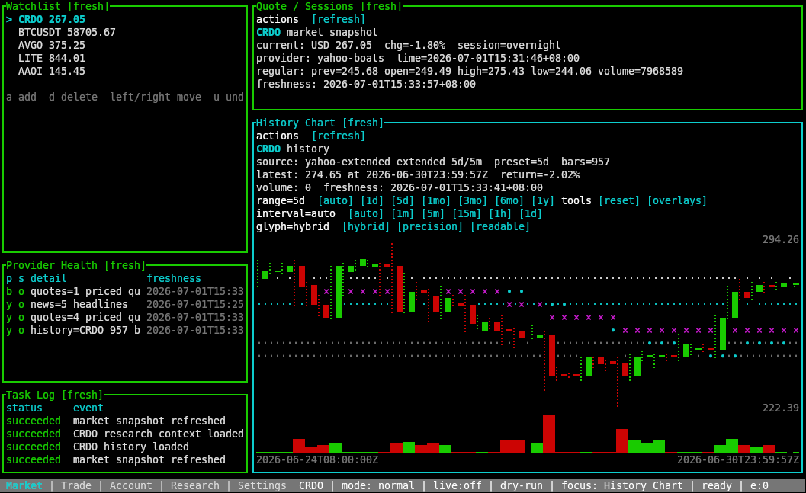
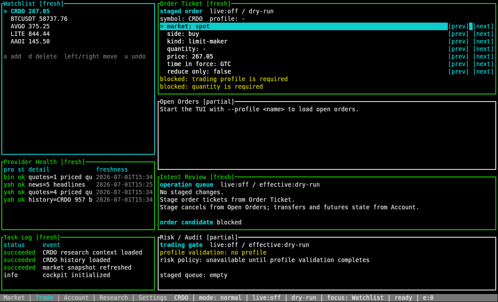

# agent-finance

[English](README.md) | [简体中文](README_ZH.md) | [日本語](README_JA.md) | [한국어](README_KO.md)

AI 에이전트가 금융시장을 조사할 때 추측이 아니라 근거를 남기도록 돕는 CLI입니다.

`agent-finance`는 AI 에이전트와 자동화 워크플로를 위한 터미널 기반 금융 툴킷입니다. 가격, 장중/프리마켓/애프터마켓/오버나이트 세션, 과거 OHLCV, 지표, 크립토 시장 구조, 예측시장 심리, 상장사 공개 데이터, URL 본문 추출, provider capability, 그리고 보호 장치가 있는 서명 거래 흐름을 하나의 CLI 표면으로 제공합니다.

`agent-finance tui`도 포함되어 있어 종목, provider health, research context, crypto evidence, prediction-market signals를 하나의 terminal cockpit에서 볼 수 있습니다.

| 마켓 cockpit | 보호 장치가 있는 거래 워크스페이스 |
|---|---|
|  |  |

설치한 뒤에는 에이전트가 CLI에서 직접 사용법을 읽어갈 수 있습니다.

```bash
npm install -g agent-finance-cli
npx skills add https://github.com/M4n5ter/agent-finance
agent-finance skills get core
```

## 에이전트가 할 수 있는 일

- "지금 얼마에 거래되고 있나?"에 대해 현재 관측 가능한 가격, 세션, 정규장 기준값, 로컬/UTC 시간을 함께 반환합니다.
- 정규장, 프리마켓, 애프터마켓, 오버나이트 가격을 분리해 서로 다른 시장 상태를 하나의 가격처럼 섞지 않습니다.
- 추세나 주문 품질을 판단하기 전에 OHLCV 히스토리와 로컬 지표를 확인합니다.
- Binance, Coinbase, OKX, CoinGecko를 넘나들며 크립토 spot, swap, futures, 호가창, 체결, 캔들, funding, open interest, 시장 폭을 비교합니다.
- Polymarket을 이벤트 확률과 시장 심리를 수치로 보는 보조 근거로 활용합니다.
- Yahoo, SEC EDGAR, Robinhood, CNBC, Stooq, URL 추출 fallback에서 no-key 리서치 데이터를 가져옵니다.
- provider 이름으로 추측하지 않고, CLI에서 각 provider가 실제로 지원하는 capability를 확인합니다.
- 단일 parseable payload를 뽑는 일이 아니라 모니터링, 비교, 조사 흐름 조정이 목적일 때는 live terminal cockpit을 엽니다.
- Binance 계정, 주문, 내부 이체 같은 쓰기 작업을 profile, intent, risk check, 명시적 live 확인, append-only audit log 뒤에 둡니다.
- 설치된 버전에 포함된 runtime skills로 에이전트가 현재 명령 체계를 학습하게 합니다.

## 왜 필요한가

금융 리서치 에이전트는 단일 가격, 검색 결과 요약, 그럴듯한 데이터 소스 이름만 믿으면 쉽게 잘못된 결론을 냅니다. 반복 가능한 데이터 수집, 가격이 어느 세션에서 온 것인지에 대한 구분, provider 한계에 대한 이해, 실제 계정을 건드릴 때 남는 감사 기록이 필요합니다.

`agent-finance`는 CLI-first로 설계되었습니다. AI 에이전트는 셸을 잘 다루고, CLI는 다음 장점이 있습니다.

- 명령이 안정적이고 스크립트화하기 쉽습니다.
- 구조화된 데이터가 필요할 때 JSON을 반환할 수 있습니다.
- 터미널 출력은 다른 에이전트나 자동화 계층이 검토하기 쉽습니다.
- provider capabilities를 런타임에 조회할 수 있습니다.
- skills가 바이너리와 함께 배포되어 문서와 실제 명령이 어긋날 가능성이 줄어듭니다.

## 설치

CLI와 discovery skill을 함께 설치합니다.

```bash
npm install -g agent-finance-cli
npx skills add https://github.com/M4n5ter/agent-finance
```

프로젝트 이름은 `agent-finance`입니다. npm에서는 `agent-finance` 이름을 사용할 수 없어 패키지만 `agent-finance-cli`로 배포합니다.

npm 패키지는 지원 플랫폼에서 사전 빌드된 바이너리를 설치합니다.

- macOS arm64 / x64
- Linux arm64 / x64
- Windows x64

일반적인 npm 설치 경로에서는 Rust가 필요하지 않습니다. 현재 플랫폼용 prebuilt package가 없으면 로컬 소스 빌드로 fallback합니다. 이 경우 Rust/Cargo와 함께 `wreq`/BoringSSL에 필요한 CMake, Clang/Clang++, libclang, binutils가 필요합니다.

GitHub:

```bash
cargo install --git https://github.com/M4n5ter/agent-finance agent-finance-cli
```

checkout:

```bash
cargo install --path crates/cli --locked
cargo run --bin agent-finance -- skills get core
```

## 에이전트 시작점

AI 에이전트에 붙일 때 플래그를 먼저 외우게 할 필요는 없습니다. 설치된 CLI가 스스로 현재 사용법을 설명하게 하세요.

```bash
agent-finance skills list
agent-finance skills get core --full
```

npm 패키지에는 표준 discovery skill도 포함되어 있습니다.

```text
skills/agent-finance/SKILL.md
```

이 stub은 에이전트를 runtime skills로 다시 안내하므로, 사용법이 설치된 바이너리와 같은 버전을 따라갑니다.

추가한 skill은 큰 방향을 잡는 입구로 두고, 구체적인 명령 사용법은 로컬의 `agent-finance skills get ...`에서 가져오면 됩니다.

자주 쓰는 runtime skills:

```bash
agent-finance skills get price
agent-finance skills get history-indicators
agent-finance skills get crypto
agent-finance skills get research-data
agent-finance skills get providers
agent-finance skills get prediction-markets
agent-finance skills get profile
agent-finance skills get tui
```

## 현지화

사람이 읽는 CLI/TUI 텍스트는 `en-US`, `zh-CN`, `ja-JP`, `ko-KR`을 지원합니다.

```bash
agent-finance --locale zh market price AAPL
agent-finance --locale ja --help
AGENT_FINANCE_LOCALE=ko agent-finance skills get core
```

locale 우선순위는 `--locale`, TUI config, `AGENT_FINANCE_LOCALE`, system locale, 마지막 `en-US`입니다.

TUI에서는 Settings에서 `language`를 바꾸면 UI 언어가 즉시 전환됩니다. config를 저장하면 언어도 함께 저장됩니다. JSON output, command names, flags, provider identifiers, schema keys, 숫자 형식, timestamps, provider가 반환한 원문은 안정적으로 유지되며 현지화하지 않습니다.

## 빠른 예시

현재 가격과 세션:

```bash
agent-finance market price CRDO
agent-finance market price CRDO MRVL --json
agent-finance market sessions CRDO
agent-finance market sessions LITE --proxy-symbol LITEUSDT
```

히스토리와 지표:

```bash
agent-finance market history CRDO --range 1mo --interval 1d
agent-finance market history CRDO --range 5d --interval 1m --session extended --adjustment raw --no-actions
agent-finance market indicators CRDO MRVL --limit 120
```

크립토 시장 구조:

```bash
agent-finance market crypto quote BTC/USDT
agent-finance market crypto book BTC/USDT --limit 20
agent-finance market crypto candles BTC/USDT --interval 1h --limit 48
agent-finance market crypto funding BTCUSDT --instrument swap --provider auto --limit 8
agent-finance market crypto open-interest BTCUSDT --instrument swap --provider okx
agent-finance market crypto discover --provider coingecko --kind trending
```

상장사 리서치와 탐색:

```bash
agent-finance market fundamentals CRDO
agent-finance market fundamentals CRDO --provider sec-edgar
agent-finance market analysis CRDO
agent-finance market options CRDO --provider robinhood --count 80
agent-finance market ownership CRDO
agent-finance market events CRDO --provider sec-edgar
agent-finance market news CRDO
agent-finance market search "optical interconnect"
agent-finance market screen day_gainers
```

예측시장 심리:

```bash
agent-finance market polymarket search "spacex ipo" --limit 5
agent-finance market polymarket market MARKET_ID_OR_SLUG --json
```

스트림, 폴링, URL 추출:

```bash
agent-finance market stream CRDO --messages 5
agent-finance market watch CRDO --interval-seconds 15 --iterations 4
agent-finance market read-url "https://www.sec.gov/Archives/edgar/data/0001807794/000162828026014017/crdo-20260131.htm"
```

provider capability 확인:

```bash
agent-finance market providers
agent-finance capabilities
```

인터랙티브 cockpit:

```bash
agent-finance tui --symbols AAPL,CRDO,BTCUSDT
agent-finance tui --symbols CRDO,LITE,AAOI --chart-preset auto
```

TUI는 watchlist, quote/sessions, history, crypto evidence, research, Polymarket, provider health, task log, 마우스 포커스, docked column 드래그 리사이즈, floating corner resize, panel close/restore, 실행 가능한 command palette, 그리고 네이티브 OHLCV 캔들 workbench를 갖춘 인터랙티브 cockpit입니다. History panel에서 `z`를 누르면 전체 차트로 들어가고, hover로 O/H/L/C/V를 확인하며, wheel이나 drag로 zoom하고, 차트 가격을 클릭하면 order ticket draft price에 채웁니다. `j`/`k`로 current price, previous close, open, high, low, open order, position entry 같은 reference line을 고른 뒤 `Enter`로 ticket에 복사할 수도 있습니다. command palette에서는 선택한 reference line을 single-leg stop-loss / take-profit ticket draft로 준비하거나 draft-only protective OCO plan에 모을 수도 있습니다. 차트는 거래 준비를 돕는 도구일 뿐 직접 submit하지 않습니다. stage, review, risk, live confirmation, audit 경로는 그대로 유지됩니다. cockpit workflow는 `agent-finance skills get tui`를 읽고, 구조화된 데이터가 필요할 때는 계속 `market ... --json` 명령을 사용하세요.

Chart preset은 provider 능력에 맞춰 조정됩니다. source 줄에는 fallback 이후 provider, session, range, provider-reported interval, bar 수가 표시됩니다.
`--no-persist`를 쓰지 않으면 TUI는 watchlist, docked panel 구성, 현재 focused panel, column layout, floating panes, refresh cadence, provider preference를 TOML로 저장합니다.

## 서명 거래 흐름

`agent-finance`는 Binance Spot과 USD-M을 위한 보호된 흐름을 포함합니다. 계정 조회, 주문 intent, 내부 이체 intent, futures state change, risk check, audit log를 다룰 수 있습니다.

핵심은 live write를 가벼운 한 줄 명령으로 노출하지 않는 것입니다. profile, risk policy, allowlist, intent file, 명시적 `--live`, provider permission check, append-only audit event를 거치도록 설계되어 있습니다.

시작점:

```bash
agent-finance skills get profile --full
agent-finance profile template --profile default
agent-finance profile doctor --profile default
```

명령 예시:

```bash
agent-finance account balances --profile default
agent-finance order create BTCUSDT --profile default --market spot --side buy --kind limit --quantity 0.001 --price 50000
agent-finance risk check INTENT_ID --profile default
agent-finance order submit INTENT_ID --profile default
agent-finance audit tail --limit 20
```

## Provider 참고사항

- `market price SYMBOL`은 "지금 가격"을 물을 때의 기본 진입점입니다.
- `market sessions SYMBOL`은 regular/pre/post/overnight/provider를 명확히 비교할 때 사용합니다.
- `market history`는 기본적으로 adjusted price를 사용하고, 명시적으로 끄지 않으면 corporate actions를 포함합니다.
- `market providers`가 capability matrix의 기준입니다. provider 이름만 보고 지원 범위를 추측하지 마세요.
- crypto 명령은 capability-first입니다. `--provider binance|coinbase|okx|coingecko`를 고정하는 것은 교차 검증이나 감사 목적일 때가 적합합니다.
- Binance와 OKX는 거래소 및 파생상품 미시구조에 강하고, Coinbase는 spot 거래소 교차 검증에 적합하며, CoinGecko는 집계 범위, trending, metadata에 유용합니다.
- Binance USD-M futures와 TradFi proxy symbols는 파생상품 또는 proxy입니다. 법적 주식, 브로커 체결가, pre-IPO 지분 가격이 아닙니다.
- Polymarket은 implied probability, spread, volume, liquidity, open interest, holder preview, probability history를 보는 보조 근거입니다. 1차 사실 데이터가 아닙니다.
- `market read-url`은 direct/Jina/Defuddle 기반 본문 추출 fallback이며, 로그인 가능한 브라우저가 아닙니다.
- 동적 페이지, 로그인 페이지, 스크린샷 판단이 필요한 페이지, 노이즈가 큰 페이지는 `agent-browser`나 OpenCLI 같은 실제 브라우저 도구로 확인해야 합니다.

## 네트워크와 로컬 상태

프록시 우선순위:

1. `--proxy`
2. `AGENT_FINANCE_PROXY`
3. `ALL_PROXY`
4. `HTTPS_PROXY`
5. `HTTP_PROXY`

예시:

```bash
agent-finance --proxy socks5h://127.0.0.1:7890 market price CRDO
agent-finance --no-proxy market price CRDO
```

테스트, 샌드박스, 에이전트 워크스페이스에서는 profile/data 루트를 덮어쓸 수 있습니다.

```bash
AGENT_FINANCE_CONFIG_HOME=/tmp/agent-finance/config \
AGENT_FINANCE_DATA_HOME=/tmp/agent-finance/data \
agent-finance profile template --profile default
```

SEC EDGAR 요청은 `AGENT_FINANCE_SEC_USER_AGENT`가 설정되어 있으면 이를 사용하고, 없으면 프로젝트 기본 user agent를 사용합니다.

`AGENT_FINANCE_SKILL_DATA_DIR`을 설정하면 runtime skill documents를 테스트하거나 교체할 수 있습니다. npm wrapper는 prebuilt platform binary를 위해 `AGENT_FINANCE_PACKAGE_ROOT`를 자동으로 설정합니다.

## 안전성

이 도구는 투자 조언이 아닙니다. 시장 데이터는 지연되거나 불완전하거나 틀릴 수 있습니다. provider payload는 변경될 수 있습니다. 소셜 신호와 예측시장 신호는 근거의 일부일 뿐 진실 그 자체가 아닙니다. 중요한 사실은 1차 자료로 확인하고 각 데이터 소스의 이용 약관을 따라야 합니다.
